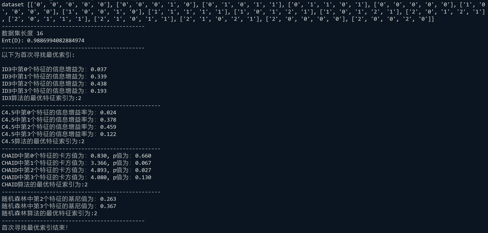
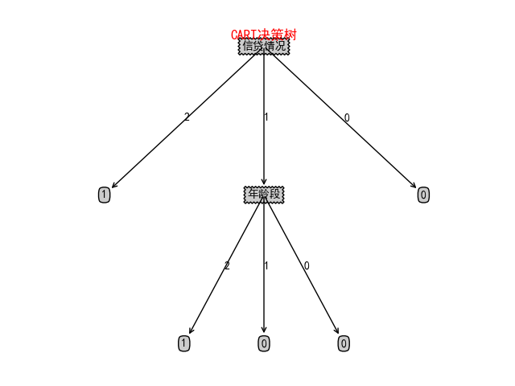

# Decision Tree

### 依赖安装
```shell
pip install matplotlib
```

### 决策树分类（ID3，C4.5，CART）
### 三种算法的区别如下：

####  (1) ID3算法以信息增益为准则来进行选择划分属性，选择信息增益最大的；<br>
```shell
python tree.py 1
```

####  (2) C4.5算法先从候选划分属性中找出信息增益高于平均水平的属性，再从中选择增益率最高的；<br>
```shell
python tree.py 2
```

####  (3) CART算法使用“基尼指数”来选择划分属性，选择基尼值最小的属性作为划分属性.<br>
```shell
python tree.py 3
```

####  (4) Random Forest（随机森林）算法是一种集成学习方法，通过构建多个决策树并将它们的预测结果进行组合来提高分类准确性和鲁棒性。<br>
```shell
python tree.py 4
```

### 本次实验我的数据集如下所示：
 ##### 共分为四个属性特征：年龄段，有工作，有自己的房子，信贷情况;
 ##### 现根据这四种属性特征来决定是否给予贷款


 #### 为了方便，我对数据集进行如下处理：
#### 在编写代码之前，我们先对数据集进行属性标注。
#### （0）年龄：0代表青年，1代表中年，2代表老年；
#### （1）有工作：0代表否，1代表是；
#### （2）有自己的房子：0代表否，1代表是；
#### （3）信贷情况：0代表一般，1代表好，2代表非常好；
#### （4）类别(是否给贷款)：no代表否，yes代表是。
#### 存入txt文件中:


#### 然后分别利用ID3，C4.5，CART三种算法对数据集进行决策树分类；
#### 具体代码见：tree.py

#### 实验结果如下：
##### （1）先将txt中数据读入数组，并打印出数据集长度，即共有多少条数据，并计算出起始信息熵Ent(D)，然后分别找出三种算法的首个最优特征索引

##### （2）下面通过相应的最优划分属性分别创建相应的决策树，并对测试集进行测试，测试集如下：


#### 结果如下：
##### ID3算法:


##### C4.5算法：


##### CART算法：



#### 由上面结果可以看出：
##### （1）ID3和C4.5的最优索引以及决策树形图是相同的，而CART的最优索引以及决策树形图与前面两者不同，这与它们的选择标准以及训练集有关；
##### （2）但同时我们也发现，三种算法对测试集的测试结果是相同的，经过后期手动匹配，结果完全正确，这说明我们的决策树实验结果是正确的。
